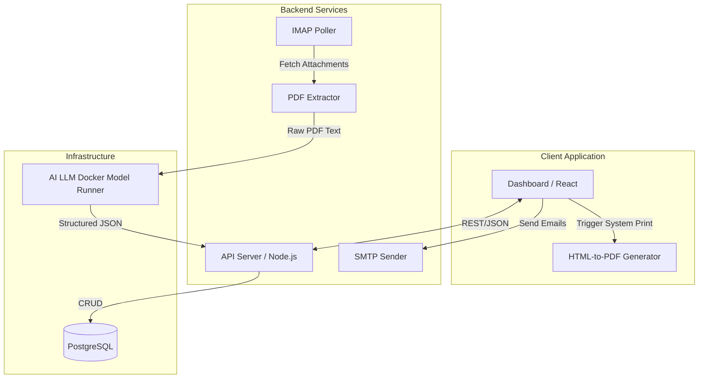

# QuoteXtract

AI-powered quotation PDF extraction dashboard. Upload PDFs or connect your email inbox — QuoteXtract automatically extracts structured data (line items, totals, supplier info) using a local or cloud AI model, then lets you review, edit, approve, and respond to quotations from a single interface.

---

## Features

- **Bulk PDF upload** — drag-and-drop multiple PDFs; AI extracts data automatically
- **Email inbox integration** — polls a Hostinger IMAP inbox every 60 seconds; PDFs in attachments are extracted automatically
- **AI extraction** — structured line-item data using a local LLM or OpenAI GPT-4o
- **Review & approve workflow** — Draft → Reviewed → Approved pipeline with confidence scores
- **Inline PDF viewer** — view the source PDF alongside the extracted data
- **Send emails** — compose and send replies directly from the app via SMTP
- **Analytics dashboard** — colorful charts showing extraction volume, status distribution, and confidence trends
- **Search** — full-text search across all quotations
- **Dark mode** — toggle between light and dark themes
- **Manual entry** — create quotations by hand without uploading a PDF

---

## Architecture & Data Flow

QuoteXtract operates on a multi-tier client-server architecture with two primary data flow pipelines: **Inbound Extraction (AI)** and **Outbound Generation (Native Print)**.

### System Architecture



### Data Flow

#### 1. Inbound Pipeline: Email & Upload Extraction
1. **Source**: Quotations arrive via bulk PDF upload or automatic IMAP inbox polling (every 60 seconds).
2. **Parsing**: The backend passes the PDFs to `pdftotext` to extract raw bounding-box text geometry.
3. **AI structuring**: Raw text is forwarded to the AI Model Runner (either Local `docker model run` or OpenAI's API GPT-4o vision fallback). 
4. **Ingestion**: AI parses out Line Items, Meta fields, Totals, and computes an `extractionScore`. Data is seeded into PostgreSQL `quotations` and `quotation_items` tables with a `draft` status.
5. **Review Workflow**: The frontend Dashboard accesses the portal via REST routes. Users review the parsed data against the inline React-PDF viewer frame and update records to `approved` or `rejected`.

#### 2. Outbound Pipeline: Custom Quotation Generation
1. **Creation**: Users navigate to the New Quotation pane to build a custom quotation form from scratch.
2. **Live Rendering**: The application uses a custom DOM-to-Print React component (`QuotationDocument.tsx`) heavily styled with Tailwind to exactly mirror complex legacy PDF layouts (using pixel-perfect grids and custom metadata fields like Destination & Warranty).
3. **Export and Track**:
   - The user triggers native `window.print()` to locally export the file as A4 scale.
   - Upon closing the print dialog, the system prompts the user to "Track in Portal".
   - Using the Frontend Zod Schema, the client directly fires an async multi-part POST request back to the API Server.
   - The generated record is ingested natively into PostgreSQL (`quotations` → `quotation_items`), bypassing the AI pipeline completely for 100% accuracy data integrity matching.

### Tech Stack Breakdown

| Layer | Technology |
|-------|-----------|
| Frontend | React 18, Vite, Tailwind CSS, shadcn/ui |
| Backend | Node.js, Express, TypeScript, Zod |
| Database | PostgreSQL 16, Drizzle ORM |
| AI | Docker Model Runner (local) or OpenAI GPT-4o |
| Email | ImapFlow (IMAP polling), Nodemailer (SMTP) |
| PDF | `pdftotext` (poppler-utils), Native Browser Printing |
| Container | Docker Compose, NGINX |

---

## Running Locally

See **[run.md](./run.md)** for full instructions.

**Windows — one-click launch:**

```
run.bat
```

**macOS / Linux:**

```bash
cp .env.example .env
# edit .env
docker model run hf.co/unsloth/Qwen3.5-0.8B-GGUF:Q4_K_M
docker compose up --build -d
```

Dashboard: **http://localhost:3000**

---

## Project Structure

```
/
├── artifacts/
│   ├── api-server/          # Express API (TypeScript)
│   │   ├── src/
│   │   │   ├── routes/      # API route handlers
│   │   │   ├── lib/         # PDF extractor, IMAP, SMTP
│   │   │   └── index.ts     # Entry point
│   │   └── Dockerfile
│   └── quotation-dashboard/ # React frontend
│       ├── src/
│       │   ├── pages/       # Route pages
│       │   ├── components/  # Shared UI components
│       │   └── App.tsx
│       ├── nginx.conf       # Production nginx config
│       └── Dockerfile
├── packages/
│   └── api-client-react/    # Generated API client + React hooks
├── docker/
│   └── init.sql             # Database schema (auto-run on first start)
├── docker-compose.yml
├── .env.example
├── run.bat                  # Windows one-click launcher
├── run.md                   # Detailed run instructions
└── README.md
```

---

## Configuration

Copy `.env.example` to `.env` and set your values. Key variables:

| Variable | Description |
|----------|-------------|
| `POSTGRES_PASSWORD` | Database password |
| `SESSION_SECRET` | Long random string for session security |
| `IMAP_EMAIL` | Email address to poll for incoming PDFs |
| `IMAP_PASSWORD` | Email password |

> The AI model (`hf.co/Qwen/Qwen2.5-1.5B-Instruct-GGUF:q4_k_m`) and its connection settings are pre-configured in `docker-compose.yml`. No additional AI environment variables are needed.

---

## Email Setup (Hostinger)

1. Go to **Settings** in the app
2. Under **Hostinger Email Integration**, enter your email and password
3. The server will auto-connect to `imap.hostinger.com:993` and poll every 60 s

For SMTP (sending emails):

1. Under **Outgoing Mail (SMTP)**, enter your email and password
2. Auto-configured for `smtp.hostinger.com:465` (SSL/TLS)

---

## Docker Commands

```bash
# Start (first time — builds images)
docker compose up --build -d

# Start (subsequent times)
docker compose up -d

# View logs
docker compose logs -f

# Stop (keeps data)
docker compose down

# Full reset (deletes all data)
docker compose down -v

# Rebuild after code changes
docker compose up --build -d
```

---

## License

MIT
